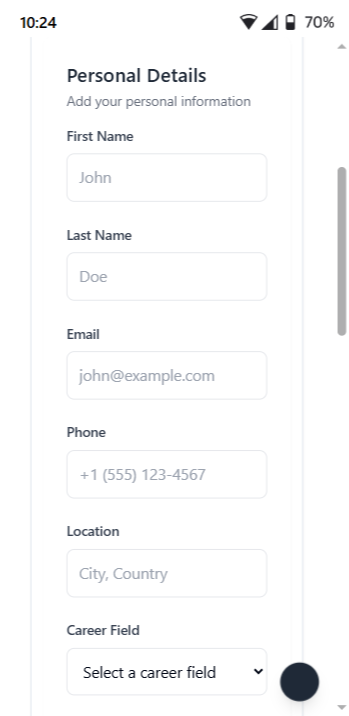
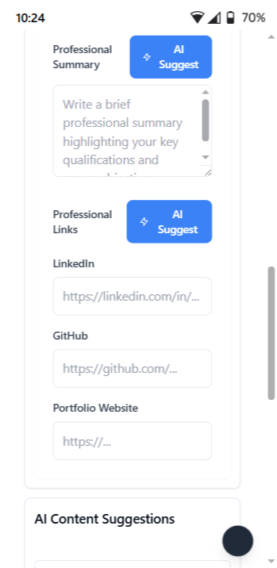
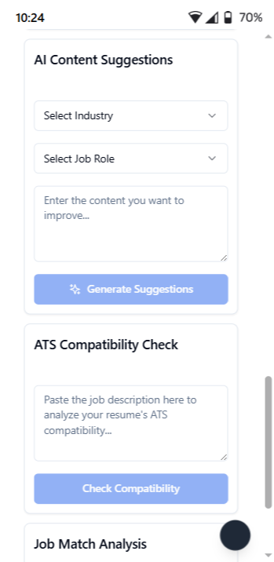
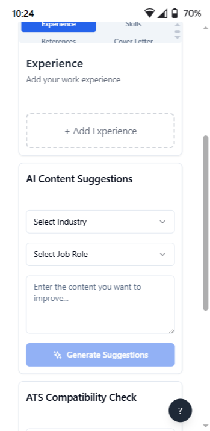
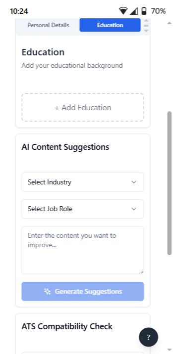
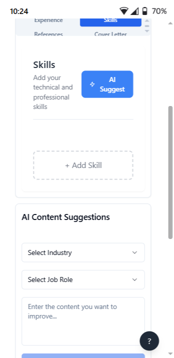
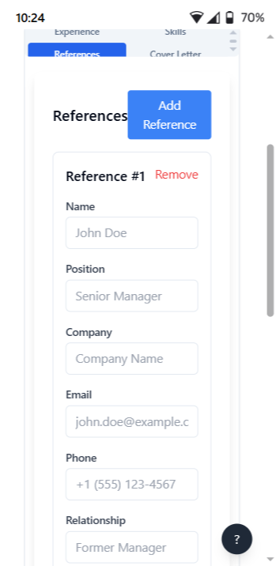
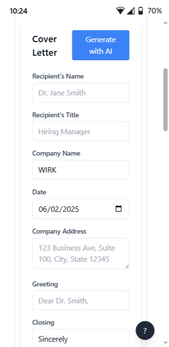
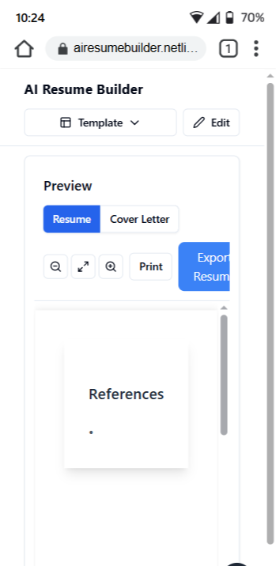
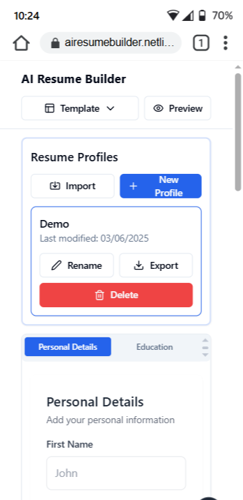

# AI Resume Builder Screenshot Walkthrough

## 1. Getting Started

### Home Page and Navigation

- Clean, intuitive interface with template selection
- Profile management system
- Quick access to all sections
- Import/Export functionality

### Personal Information

- Basic contact information
- Professional links integration
- Career field selection
- Location and contact details
- AI-powered summary generation

## 2. Main Features

### Professional Summary and Links

- AI-assisted summary generation
- Professional links section
  - LinkedIn integration
  - GitHub profile
  - Portfolio website
- Smart suggestions for content improvement

### Experience Section

- Work history management
- AI content suggestions
- Industry-specific recommendations
- ATS compatibility checking

### Education Section

- Educational background input
- AI-powered content enhancement
- Industry-tailored suggestions
- Compatibility analysis

### Skills Management

- Technical and professional skills
- AI skill suggestions
- Add/Remove functionality
- Skill categorization

### References

- Reference management
- Contact information
- Professional relationship
- Easy addition/removal

## 3. AI Features

### Content Suggestions

- Industry selection
- Role-specific suggestions
- Content improvement
- Smart recommendations

### ATS Compatibility

- Resume analysis
- Keyword optimization
- Format verification
- Improvement suggestions

## 4. Document Generation

### Cover Letter Generation

- AI-powered generation
- Professional formatting
- Customizable fields:
  - Recipient details
  - Company information
  - Custom greeting and closing

### Resume Preview and Export

- Real-time preview
- Multiple format export
- Print functionality
- Layout verification

## 5. Profile Management

### Resume Profiles

- Multiple resume versions
- Import/Export capabilities
- Profile renaming
- Easy management

## Using the Interface

### Navigation Tips
- Use the top navigation bar to switch between sections
- AI suggest buttons provide context-specific help
- Save progress automatically
- Export in multiple formats

### Best Practices
1. Fill in all sections completely
2. Use AI suggestions for optimization
3. Check ATS compatibility regularly
4. Preview before finalizing
5. Keep multiple versions for different jobs

[Note: The interface is designed to be intuitive and user-friendly, with consistent styling and clear calls-to-action throughout.] 
