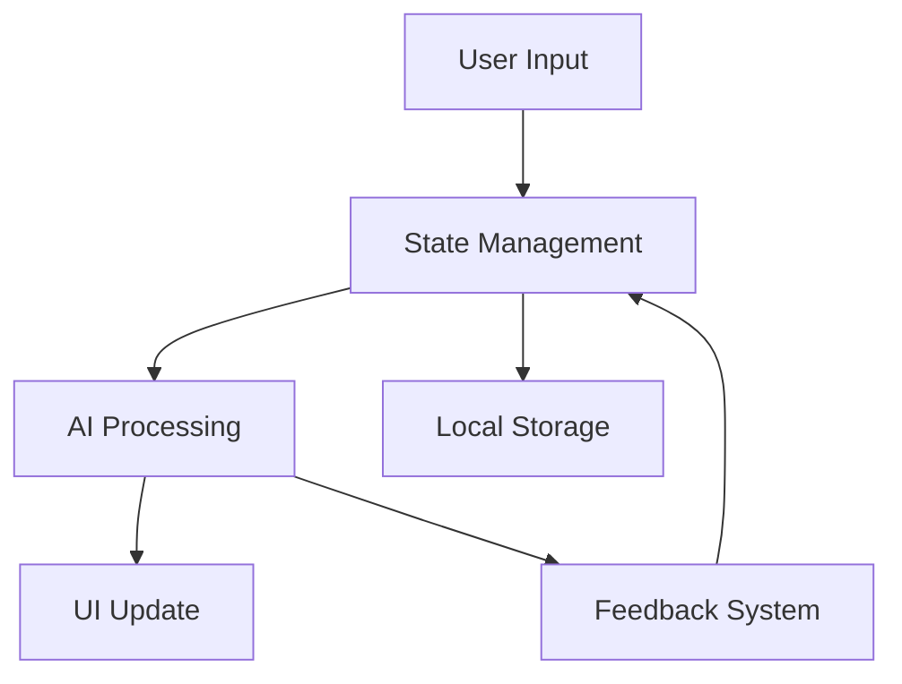

# AI Resume Builder Technical Report

## 1. Architecture Decisions and Technology Stack

### 1.1 Frontend Architecture
- **Framework**: React with Vite
  - Fast development with HMR
  - Optimized build process
  - Modern tooling ecosystem
- **State Management**: Context API for global state
  - Centralized resume data management
  - Template preferences
  - User settings and history
- **Styling**: Tailwind CSS for responsive design
  - Utility-first approach
  - Custom design system
  - Responsive breakpoints
- **UI Components**: Material-UI (MUI) for consistent design
  - Accessibility built-in
  - Theme customization
  - Responsive components

### 1.2 AI Integration
- **LLM Provider**: Groq API
  - High-performance inference
  - Low latency responses
  - Cost-effective scaling
- **Model**: LLaMA 3.3 70B Versatile
  - Optimized for content generation
  - Context-aware suggestions
  - Multi-language support
- **Integration Points**:
  - Content generation with context awareness
  - ATS analysis with industry-specific metrics
  - Job matching with skill alignment
  - Keyword optimization based on job market trends

### 1.3 Data Flow Architecture


## 2. API Integration Methodology

### 2.1 AI Service Integration
- **Modular API Client**
  ```javascript
  class AIClient {
    async generateContent(prompt, context) {
      // Rate limiting and retry logic
      const response = await this.makeRequest(prompt, context);
      return this.processResponse(response);
    }
    
    async analyzeATS(content) {
      // ATS analysis with industry benchmarks
      return this.processATSAnalysis(content);
    }
  }
  ```
- **Error Handling Strategy**
  - Graceful degradation
  - Fallback content options
  - User feedback mechanisms
- **Rate Limiting**
  - Token bucket algorithm
  - Request queuing
  - Usage optimization

### 2.2 Export Services
- **PDF Generation**
  - Custom fonts and styling
  - Page break optimization
  - Image handling
- **DOCX Export**
  - Template-based generation
  - Style preservation
  - ATS compatibility
- **Format Consistency**
  ```javascript
  class ExportService {
    async exportToPDF(resume) {
      const doc = new jsPDF();
      // Custom rendering logic
      return doc.save();
    }
    
    async exportToDOCX(resume) {
      const doc = new Document();
      // Style mapping and content insertion
      return doc.save();
    }
  }
  ```

## 3. Template Design Approach

### 3.1 Component Architecture
```javascript
// Base template component
const BaseTemplate = ({ data, style }) => {
  return (
    <div className={`template ${style.layout}`}>
      <Header data={data.personal} style={style.header} />
      <Content sections={data.sections} style={style.content} />
      <Footer data={data.footer} style={style.footer} />
    </div>
  );
};

// Specialized templates
const ModernTemplate = (props) => (
  <BaseTemplate {...props} style={modernStyle} />
);
```

### 3.2 Template Features
- **Modern Template**
  - Grid-based layout
  - Dynamic spacing system
  - Custom color schemes
- **Minimal Template**
  - Typography-focused design
  - Whitespace optimization
  - Content hierarchy
- **Professional Template**
  - Traditional sections
  - Formal styling
  - Print optimization
- **Classic Template**
  - Two-column layout
  - Comprehensive sections
  - Customizable colors

### 3.3 Responsive Design
```css
.template {
  @apply max-w-4xl mx-auto;
  
  @screen sm {
    @apply p-4;
  }
  
  @screen md {
    @apply p-6 grid grid-cols-12 gap-4;
  }
  
  @screen lg {
    @apply p-8;
  }
}
```

## 4. Performance Optimization Techniques

### 4.1 Code Optimization
- **Code Splitting**
  ```javascript
  const Template = React.lazy(() => import('./templates/${type}'));
  ```
- **Component Memoization**
  ```javascript
  const MemoizedSection = React.memo(Section);
  ```
- **Virtual List Rendering**
  ```javascript
  const VirtualList = ({ items, height, itemHeight }) => {
    const [visibleItems, setVisibleItems] = useState([]);
    // Virtual scroll implementation
  };
  ```

### 4.2 Resource Optimization
- **Image Loading**
  - Lazy loading
  - WebP format
  - Responsive sizes
- **Font Loading**
  ```javascript
  const FontLoader = () => {
    useEffect(() => {
      // Load fonts progressively
    }, []);
  };
  ```
- **CSS Optimization**
  - Critical CSS extraction
  - Unused CSS removal
  - Style minification

### 4.3 State Management
- **Efficient Updates**
  ```javascript
  const useResumeState = () => {
    const [state, dispatch] = useReducer(reducer, initialState);
    // Optimized state updates
  };
  ```
- **Caching Strategy**
  - Local storage persistence
  - Memory cache
  - Service worker cache

## 5. Known Limitations and Future Enhancements

### 5.1 Current Limitations
- API rate limits affect real-time suggestions
- Template customization requires reload
- Limited export format options
- Basic feedback analysis system

### 5.2 Planned Enhancements
1. **Advanced Features**
   - Real-time collaboration
   - Version control system
   - Advanced template editor
   - Enhanced ATS analysis
2. **Technical Improvements**
   - Serverless architecture
   - Enhanced caching
   - PWA implementation
   - Error recovery system
3. **User Experience**
   - More templates
   - Advanced customization
   - Mobile optimization
   - Accessibility improvements

### 5.3 Security Considerations
- Data encryption at rest
- Secure API communication
- User data protection
- Export security measures

## 6. Evaluation Metrics

### 6.1 User Experience
- Time to first interaction
- Task completion rates
- Error occurrence rates
- User satisfaction scores

### 6.2 Technical Performance
- Load time metrics
- API response times
- Export generation speed
- Resource utilization

### 6.3 Output Quality
- ATS pass rates
- Template rendering accuracy
- Content generation quality
- Export format fidelity

## 7. Innovation in AI Applications

### 7.1 AI Features
- Smart content suggestions
- Context-aware formatting
- Industry-specific optimization
- Personalized recommendations

### 7.2 Future AI Integration
- Advanced NLP processing
- Machine learning optimization
- Automated improvements
- Predictive features

## 8. Conclusion

The AI Resume Builder demonstrates innovative use of modern web technologies and AI capabilities while maintaining high performance and user experience standards. The modular architecture and extensive optimization techniques provide a solid foundation for future enhancements and scaling. 